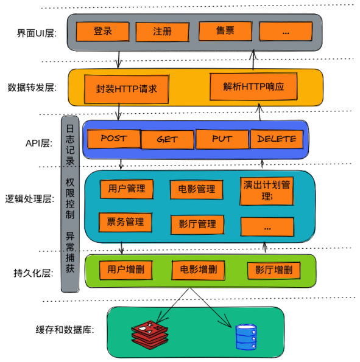
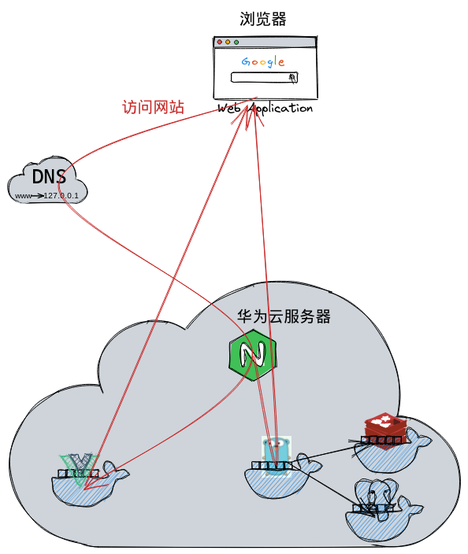
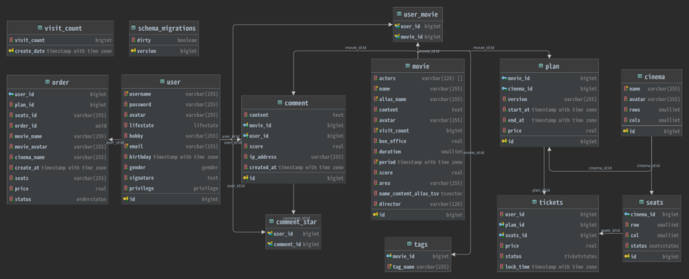

# TTMS影院管理系统

<a href="https://ttms.humraja.xyz/web/">演示网页</a> <a href="https://ttms.humraja.xyz/ttms/swagger/index.html#">接口文档</a> 使用的是学校提供的华为服务器，可能不久之后就会失效。

## 项目架构

逻辑结构：



物理结构：



开发架构：

```c
.
├── bin // 存放可执行文件
├── cert // 存放证书
├── config // 配置文件层
│   ├── app // 服务器本地配置文件
│   ├── app_docker // 服务器docker下配置文件
│   ├── postgres // 数据库配置文件
│   └── redis // redis配置文件
├── docs // 接口文档
├── internal // 具体代码层
│   ├── api // api层
│   │   └── v1
│   ├── dao // 持久化层
│   │   ├── db // 数据库dao操作
│   │   │   ├── migration // 数据库数据定义语句(用于版本控制)
│   │   │   ├── query // 数据查询语句
│   │   │   └── sqlc // 生成go代码目录
│   │   └── redis // redis操作
│   │       └── query // 查询语句
│   ├── global // 全局变量
│   ├── logic // 逻辑处理层
│   ├── manager // 管理结构(用于票和订单的管理)
│   ├── middleware // 中间件层(限流，鉴权，日志，捕获错误等)
│   ├── model // 模型层
│   │   ├── common // 通用模型
│   │   ├── config // 配置文件模型(用于加载和使用配置文件)
│   │   ├── reply // 响应模型(响应的回复)
│   │   └── request // 请求模型(请求参数的绑定)
│   ├── pkg // 其他包
│   │   ├── alipay // 用于支持支付宝支付
│   │   ├── app // 项目规范化
│   │   │   └── errcode // 错误处理
│   │   ├── email // 邮件
│   │   ├── goroutine // 并发相关包
│   │   │   ├── heal // 监听并治愈协程
│   │   │   ├── pattern // 常用并发模式
│   │   │   ├── task // 定时任务
│   │   │   └── work // 工作池
│   │   ├── ipaddr // ip查询所在地
│   │   ├── limiter // 限流
│   │   │   ├── api // api混合限流
│   │   │   └── bucket // 普通限流
│   │   ├── logger // 日志
│   │   ├── mangerFunc
│   │   ├── password // 加密
│   │   ├── setting // 配置文件的管理
│   │   ├── singleflight // 防止缓存穿透
│   │   ├── snowflake // 雪花算法ID生成
│   │   ├── times // 时间处理操作
│   │   ├── token // token操作
│   │   └── utils // 工具包(格式转换，随机数生成等)
│   ├── routing // 路由层
│   │   └── router // 初始化路由
│   ├── setting // 初始化设置
│   ├── upload // 上传文件服务
│   └── worker // 工作池
│       ├── email // 邮件
│       └── ipaddr // 查询IP地址
├── static // 静态文件
└── storage // 本地持久化
    └── Applogs // 项目日志
```

数据库设计:



## 启动
配置文件:`config/app/app.yml`和`config/app_docker/app.yml`
```yml
# 本机测试文件
Server: # 服务配置
  RunMode: debug # release 为生产模式
  Address: :8080 # 监听端口
  ReadTimeout: 5s
  WriteTimeout: 5s
  DefaultContextTimeout: 30s #默认超时时间
App: # App配置文件
  Name: ttms
  Version: 1.0.0
  StartTime: 2022-05-21
Log: # 日志配置文件
  Level: debug
  LogSavePath: "storage/Applogs/" # 日志保存路径
  HighLevelFile: error          # 高级别日志文件名
  LowLevelFile: info          # 低级别文件名
  LogFileExt: .log          # 日志文件后缀
  MaxSize: 10 # 日志文件最大大小
  MaxAge: 30 # 日志文件最大保存天数
  MaxBackups: 7 # 最大备份数
  Compress: false # 是否压缩
Page: # 分页
  DefaultPageSize: 10
  MaxPageSize: 20
  PageKey: page
  PageSizeKey: page_size
Postgresql: # Postgresql配置
  DriverName: postgresql # 驱动名
  SourceName: "postgres://root:123456@****:5432/ttms?sslmode=disable&pool_max_conns=10"
Redis: # Redis配置
  Address: "****:7963"
  DB: 0
  Password: 123456
  PoolSize: 100 #连接池
  CacheTime: 1h
Token: # Token配置
  Key: "12345678123456781234567812345678"
  AssessTokenDuration: 15m
  RefreshTokenDuration: 24h
  AuthorizationKey: Authorization # 授权头密钥
  AuthorizationType: bearer # 承载前缀
Rule: # 规则配置
  UsernameLenMax: 32 # 用户名最大长度
  UsernameLenMin: 1 # 用户名最小长度
  PasswordLenMax: 32 # 密码最大长度
  PasswordLenMin: 6 # 密码最小长度
  CommentLenMax: 500 # 评论最大长度
  RowsMax: 10 # 最大影厅行数
  ColsMax: 20 # 最大影厅列数
  MovieNameLenMax: 100 # 最大电影名长度
  ActorsLenMax: 10 # 最大演员列表长度
  ContentLenMax: 1000 # 最大简介长度
  AreaLenMax: 20 # 最大区域长度
  TagLenMax: 20 # 最大标签长度
  TagsLenMax: 5 # 最大标签列表长度
  DefaultCoverURL: "https://avatars.githubusercontent.com/u/76676061?v=4" # 默认封面
  MaxFileSize: 5242880 # 最大文件大小
  MoviesOrderByBoxOfficeSize: 10 # 票房排行榜电影数量
  MoviesOrderByBoxOfficePage: 5 # 票房排行榜页数
  MoviesOrderByUserMovieCountSize: 10 # 用户期待电影榜数量
  MoviesOrderByUserMovieCountPage: 5 # 用户期待电影榜页数
  LockTicketTime: 15m # 锁票时间
  AvatarLenMax: 255 # 头像链接最大长度
  InviteCodeTime: 15m # 邀请码有效时间
Auto: # 自动任务配置
  MovieVisitCountDuration: 10m # 电影近期访问量刷新时间
  CommentStarDuration: 10m # 评论点赞刷新时间
  UserMarkDuration: 60s # 用户发送验证码间隔时间
  CodeMarkDuration: 1h # 验证码有效时间
  MoviesOrderByBoxOfficeDuration: 10m # 票房排行榜电影更新时间
  MoviesOrderByUserMovieCountDuration: 10m # 用户期待电影榜时间
  DeleteOutDatePlansDuration: 10m # 删除过期计划时间
  AddVisitCountDuration: 1h # 添加访问量间隔
Worker: # 工作池配置
  TaskChanCapacity: 50 # 任务队列容量
  WorkerChanCapacity: 50 # 工作队列容量
  WorkerNum: 10 # 工作池数量
Limit:
  IPLimit: # IP限流
    Cap: 10           # 令牌桶容量
    GenNum: 5         # 令牌产生数
    GenTime: 1       # 令牌产生时间
    Cost: 1           # 本次取走的令牌数
  APILimit: # API限流
    Email:
      - Count: 5
        Duration: 1s
        Burst: 5
      - Count: 30
        Duration: 1m
        Burst: 5
    Upload:
      - Count: 1
        Duration: 1s
        Burst: 1
Email: # 邮件配置
  Host: smtp.qq.com
  Port: 465
  UserName: "1647193241@qq.com" # 发送邮箱
  Password: "****" # 发送邮箱密钥
  IsSSL: true
  From: "1647193241@qq.com" # 发送邮箱
  To: # 接收邮箱
    - "1647193241@qq.com"
AliyunOSS: # OSS配置
  Endpoint: "https://oss-cn-hangzhou.aliyuncs.com"
  AccessKeyID: "****"
  AccessKeySecret: "****"
  BucketName: "raja-img"
  BucketUrl: "https://****"
  BasePath: "ttms/"
AliPay: # 支付宝配置
  kAppID: "2021000121601691" # APPID
  kPrivateKey: "" # 私钥
  AppPublicCertPath: "cert/appCertPublicKey.crt"            # app公钥证书路径
  AliPayRootCertPath: "cert/alipayRootCert.crt"             # alipay根证书路径
  AliPayPublicCertPath: "cert/alipayCertPublicKey_RSA2.crt" # alipay公钥证书路径
  NotifyURL: "https://域名/notify"             # 异步通知地址
  ReturnURL: "https://域名/callback"           # 回调地址
  IsProduction: false                                       # 是否为生产环境
```
`docker-compose up`具体的配置可以修改docker-compose.yaml。

自己可以通过`docker build -t ttms:app .`构建，`docker tag ttms_app:latest 1647193241/ttms_app:latest`标记，然后`docker push 自己的仓库地址/ttms_app:latest`上传到自己的镜像仓库。

然后修改docker-compose.yaml中对应的镜像地址,最后`docker-compose up`启动。

## redis-cell

github.com/brandur/redis-cell/releases

### 配置文件(添加到redis.conf)

```text
loadmodule /etc/redis/libredis_cell.so
```

## postgres 全文检索配置

```postgresql
--连接到目标数据库，创建zhparser解析器
CREATE EXTENSION zhparser;
-- 将zhparser解析器作为全文检索配置项
CREATE TEXT SEARCH CONFIGURATION chinese (PARSER = zhparser);
--普遍情况下，我们只需要按照名词(n)，动词(v)，形容词(a)，成语(i),叹词(e)和习用语(l)6种方式对句子进行划分就可以了，词典使用的是内置的simple词典，即仅做小写转换
ALTER TEXT SEARCH CONFIGURATION chinese ADD MAPPING FOR n,v,a,i,e,l WITH simple;

-- 查看分词效果
-- select to_tsvector('chinese', '白垩纪是地球上海陆分布和生物界急剧变化、火山活动频繁的时代');

-- 全文索引
create index movie_name_content_idx on movie using gin (to_tsvector('chinese', name || content));

-- 全文检索
select *
from movie
where to_tsvector('chinese', name || content) @@ plainto_tsquery('日本');

-- 添加分词字段
ALTER TABLE movie
    ADD COLUMN name_content_tsv tsvector;

-- 将字段的分词向量更新到新字段中
UPDATE movie
SET name_content_tsv = to_tsvector('public.chinese', coalesce(name, '') || coalesce(content, ''));

-- 全文检索
select *
from movie
where name_content_tsv @@ plainto_tsquery('小日子');

-- 触发器更新
CREATE TRIGGER trigger_posts_tsv_content
    BEFORE INSERT OR UPDATE
    ON movie
    FOR EACH ROW
EXECUTE PROCEDURE
    tsvector_update_trigger(name_content_tsv, 'public.chinese', name, content)
```

### 分词配置(添加到postgres.conf)

```shell
docker run -i --rm chenxinaz/zhparser:latest cat /usr/share/postgresql/postgresql.conf.sample > config/postgres/my_postgres.conf
```

```text
zhparser.multi_short = true #短词复合: 1
zhparser.multi_duality = true  #散字二元复合: 2
zhparser.multi_zmain = true  #重要单字复合: 4
zhparser.multi_zall = false  #全部单字复合: 8
```
